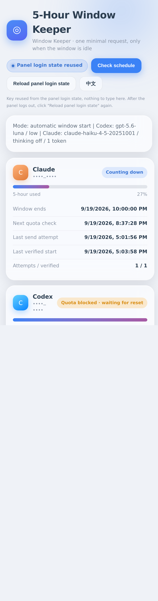
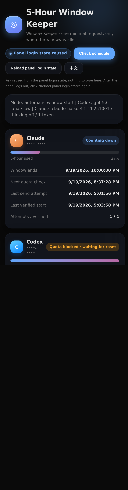

# CPA Window Keeper

[](https://github.com/xieyuanqing/cpa-window-keeper/actions/workflows/ci.yml)
[](LICENSE)

A native **CLIProxyAPI** C-ABI plugin that starts a new **five-hour usage window** with a tiny
model request when the previous window has already ended (or no window has started yet).

It does **not** reset provider limits, bypass cooldowns, or increase quota. It only sends the
smallest possible request that makes the provider's own 5-hour timer start, so the next window
is available earlier instead of waiting for the first real request of the day.

## Screenshots

The dashboard is served from inside the CPA Manager Plus sidebar (same-origin iframe) and
follows the panel's theme variables. It is built as a glass/IOS-style card layout with no
credential prompt when the panel login state can be reused. The interface is bilingual
(English / 简体中文) and follows the panel's own language setting.

| Light | Dark |
| --- | --- |
|  |  |

Both screenshots are full-height captures of the dashboard exactly as it is served inside the
sidebar, taken from a live panel with every account identifier masked (`••••…••••`) in the DOM
before the image is written; the capture script refuses to save an image that still contains an
auth index or an email address.

## Status and compatibility

- Built and tested against CPA **v7.3.4 / 8335eac**, Linux amd64, glibc.
- Native ABI 1, RPC schema 6. No CPA source modification is required.
- Metadata `GitHubRepository` points at this repository; the plugin can be registered from a plain
  `.so` placed in the host plugin directory.
- Default is **`dry_run: true`**: quota queries only, no generation.

## Behavior

1. Enumerate credentials using `host.auth.list`. Skip manually disabled accounts and providers
   outside the allowlist.
2. Read fresh OAuth tokens through `host.auth.get`; query the real usage endpoints via `host.http.do`.
3. Accept only a recognized five-hour quota shape. Missing/malformed fields, failed queries,
   unknown denials and weekly exhaustion never trigger a generation. Free/monthly-only Codex
   windows are skipped.
4. An active reset timestamp means no request. A moving, full-length zero-use Codex placeholder
   requires two observations; a fixed reset timestamp with a rounded `0%` is not treated as idle.
5. Confirm idle over a grace interval, then reserve the send on disk **before** calling
   `host.model.execute` with the exact `auth_id` and `forced_provider`.
6. Query quota afterwards. A model HTTP success alone is not counted as a verified window start.
7. Persist a five-hour-plus-grace send guard even for ambiguous request failures, so there is no
   immediate retry storm, including after crashes or reloads.

The normal scheduler checks every 60 seconds. Known active windows are queried at most once per
15 minutes, with a check scheduled around their reset. Errors back off from 5 to 40 minutes. A
separate weekly block is periodically rechecked. Model-specific Claude Sonnet/Opus quotas do not
block the default Haiku request.

## Minimal models

Defaults verified against the author's account/model list and local price table:

- **Codex**: `gpt-5.6-luna`, `reasoning.effort=low`, short `Reply OK.` input, empty tools, no
  conversation history, no storage.
- **Claude**: `claude-haiku-4-5-20251001`, `thinking.type=disabled`, `max_tokens=1`, one `Hi`
  user message.

CPA removes Codex `max_output_tokens`; there is **no guaranteed one-token cap** for Codex — do
not advertise one. A real protocol smoke request returned input=305 / output=5 / reasoning=0 for
Codex and input=100 / output=1 for Claude. Provider and CPA protocol overhead is not fully
controllable by the plugin.

There is no automatic fallback to a larger model. If a configured model becomes unavailable, fix
the model setting rather than silently increasing cost. **Edit the model names in your config** —
they are provider/account specific and will drift over time.

## Configuration

Merge the following entry into the existing CPA configuration; do not replace the whole file
(see `config.example.yaml`):

```yaml
plugins:
  enabled: true
  configs:
    cpa-window-keeper:
      enabled: true
      dry_run: true  # set false only after observing correct account/window detection
      codex_enabled: true
      claude_enabled: true
      codex_model: gpt-5.6-luna
      claude_model: claude-haiku-4-5-20251001
      poll_seconds: 60
      grace_seconds: 30
      account_allowlist: ""  # optional comma-separated auth_index values
      state_path: plugins/data/cpa-window-keeper/state.json
```

The default state directory lives inside the persistent plugin bind mount. Directory permissions
are `0700` and state/lock files are `0600`. State contains quota values, timestamps and indexes —
never OAuth tokens.

## Install

1. Build (or download a release artifact):
   ```bash
   bash scripts/build.sh          # Docker build, CPU-pinned; see "Build and test"
   ```
2. Put the artifact in the host plugin directory, e.g.
   `plugins/linux/amd64/cpa-window-keeper-v0.1.7.so`. Use a **new versioned filename** per
   release; never overwrite a library mapped into a running CPA process. Plugin discovery picks
   the highest versioned filename.
3. Add the config block above and enable the plugin. The first enable must be a real
   `false → true` transition; patching `true → true` can skip rediscovery and leave a newly
   copied plugin unregistered.
4. Watch the dashboard in `dry_run: true` until account/window detection looks right, then set
   `dry_run: false`.

Helper scripts default to the author's deployment layout and accept environment overrides:
`CPA_ROOT` (default `/root/CLIProxyAPI`), `CPAMP_ENV_FILE`
(default `/opt/cpa-manager-plus/.env`), `CPAMP_PANEL_URL` (browser checks).

## UI / API

- Static public resource: `GET /v0/resource/plugins/cpa-window-keeper/dashboard`
- Authenticated status: `GET /v0/management/cpa-window-keeper/status`
- Authenticated scheduler trigger: `POST /v0/management/cpa-window-keeper/check`

The trigger does not bypass account eligibility, query scheduling, the idle grace interval or
durable duplicate protection. No force-send endpoint is exposed.

Reached from a CPA Manager Plus sidebar entry, the dashboard reuses the panel login state: it
reads the panel's `cli-proxy-auth` entry from same-origin `localStorage` (CPAMP's reversible
obfuscation, salt `cli-proxy-api-webui::secure-storage`), and only when `rememberPassword` is set
and the stored `apiBase` origin matches the current origin. Both storage versions are supported:
`enc::v2::` (current panel builds; salt `cli-proxy-api-webui::secure-storage|v2|` + host) and
`enc::v1::` (older builds; salt + host + user agent). Supporting both keeps the dashboard working
across a panel upgrade — decoding only v1 silently degrades to the manual key prompt.
The key stays in page memory; the public HTML carries no credential.

- Panel logged in **with 「记住密码」** → the page connects automatically, no key prompt, and the
  badge shows the panel login state was reused.
- Panel logged in without it (or logged out) → the key field appears as the only fallback, since
  CPA management routes always require a bearer credential and current CPAMP builds expose no
  `postMessage` credential bridge (verified: the deployed bundle contains no `cpamp:*` protocol,
  only a theme-style bridge).

The dashboard's inline script carries `data-cfasync="false"`. Cloudflare Rocket Loader rewrites
inline scripts into a non-executable `<type>-text/javascript` type and relies on its own loader to
restore them; the plugin CSP (`script-src 'unsafe-inline'`) blocks that loader, so without the
opt-out attribute the dashboard renders but its script never runs. Verify the attribute survives
when changing the reverse proxy or CSP.

The panel injects its theme variables (`--primary-color`, `--app-surface`, `--text-primary`,
`--border-color`) into the plugin iframe and sets `data-theme="white" | "dark"` on the document
element; the dashboard styles itself from those values, so it follows the panel theme.

The dashboard is bilingual (English / 简体中文) and follows the panel's language. It reads the
panel's own `cli-proxy-language` entry from same-origin `localStorage`
(`{"state":{"language":"en"|"zh-CN"}}`), falls back to the parent document's `<html lang>`, then to
`navigator.language`. The page also listens for the `storage` event, so switching the language in
the panel re-renders the dashboard immediately, without reloading the iframe. The `EN / 中文`
button in the toolbar overrides the language for the current view only and does not write the
panel's stored choice; reloading returns to the panel language. CPA registers plugin metadata (the
sidebar label, the description and the config field help) as single static strings and does not
localize them, so those follow whatever was registered.

## Build and test

```bash
bash scripts/build.sh        # docker (golang:1.26-bookworm), 1 CPU, GOMAXPROCS=1, race tests + vet + c-shared build
python3 scripts/abi_smoke.py # synthetic, credential-free host driving the real compiled .so via ctypes
```

The Docker build needs dependencies already present in `/root/go/pkg/mod` (or run
`go mod download` first) and keeps the build container offline. Without Docker, a normal
Go toolchain with GCC works: `go test -race ./... && go build -buildmode=c-shared -o dist/plugin.so`.

- `quota_test.go`: strict provider schemas, expired/current windows, free accounts, weekly and
  model-specific blocks, invalid inputs.
- `engine_test.go`: mock clock (no wall-clock sleeps); active/idle/repeat, dry run, backoff,
  failure reservation, restart and concurrency deduplication, persistent locks, corrupt-state
  fail-closed behavior.
- `backend_test.go`: exact account pinning, minimal request payloads, redacted failures, cancellation.
- `app_test.go`: lifecycle join, quiesce, reconfigure, shutdown and resource behavior.
- `scripts/abi_smoke.py`: explicitly **synthetic** host exercising the real compiled `.so` through
  ctypes and the C ABI.
- `scripts/prepare_sandbox.py` / `sandbox_verify.py` / `sandbox_lifecycle.py`: isolated CPA
  container checks using read-only OAuth access-token snapshots **without refresh tokens**.
- `scripts/verify_i18n.py`: drives the live panel with a real browser, switches the panel language
  between `en` and `zh-CN`, and asserts the dashboard follows (title, buttons, session badge,
  status labels, meter caption), that an in-page change is followed over the `storage` event
  without reloading the iframe, that the toolbar override does not write the panel's stored
  choice, and that no `{0}`-style placeholder or stray CJK reaches an English screen. Needs a
  public panel URL and the browser wrapper: `CPAMP_PANEL_URL=... /opt/browser-automation/run.sh
  scripts/verify_i18n.py`.
- `scripts/make_readme_shots.py`: regenerates `docs/dashboard-light.png` / `docs/dashboard-dark.png`
  from the live panel in English, masks account identifiers in the DOM before capture, and refuses
  to write an image that still contains one.

Real provider measurements and production behaviour are recorded in
[VERIFICATION.md](VERIFICATION.md). Private sandbox credentials are deliberately kept outside
this project and are never included in distributable archives.

## Operational caveats

- Host callbacks are synchronous and cannot be cancelled mid-call from this ABI without a
  request-scoped host context. Shutdown/quiesce **joins** the worker before CPA frees callback
  memory. A stuck host network call can delay unload; never force a timeout-and-detach while its
  callback is still running.
- The plugin makes one host execution attempt per reservation; CPA may still retry upstream
  failures according to its own global `request-retry` setting.
- Quota HTTP callbacks use the host/global transport. Per-credential proxy overrides are not
  propagated by `host.http.do`; deployments that require them need additional support.
- Removing or corrupting the state file defeats durable history. Corrupt state fails closed rather
  than silently resetting the send guard. Do not point multiple installations at different state
  paths for the same credentials.
- Tests simulate five-hour advancement with a mock clock; they are not a claim of having waited
  through repeated live cycles. First production-cycle confirmation must come from quota readback
  in the status page.

## Disclaimer

This project automates requests against **your own** provider credentials through your own
CLIProxyAPI instance. It does not circumvent provider limits: it only starts the official timer.
You are responsible for complying with the terms of service of every provider you connect, and for
any quota or billing consequences of enabling `dry_run: false`. Provided as-is, without warranty.

## License

MIT — see [LICENSE](LICENSE). Third-party license notices: [THIRD_PARTY_LICENSES.md](THIRD_PARTY_LICENSES.md).
